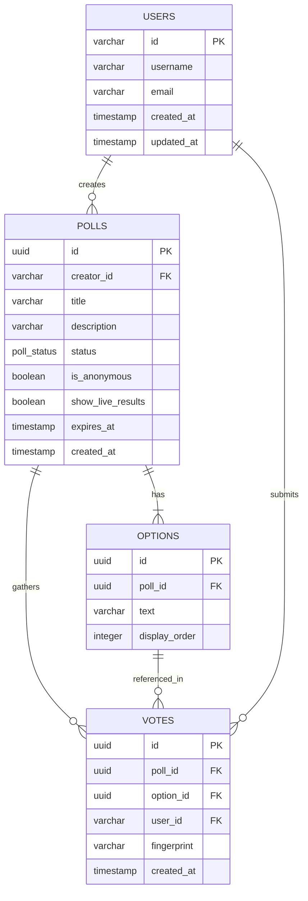

# ⚡ Pulse — Real-Time Live Polling Platform

Pulse is a modern, real-time polling application designed with an elegant dark mode user interface. It enables creators to launch live polls, track incoming votes with sub-second latency, inspect voting speed via hourly velocity sparklines, and download high-quality results as shareable social cards.

---

## 🚀 Key Features

*   **Sub-second Live Updates**: Powered by WebSockets (Socket.IO) to dynamically recalculate poll counts and animate bar widths instantly across all connected screens.
*   **Flexible Voting Privacy**:
    *   *Anonymous Mode*: Open public voting using browser fingerprints (SHA-256 of IP + headers) and cookies to prevent duplicate responses.
    *   *Authenticated Mode*: Requires users to sign in through Iris Auth, enforcing one vote per registered user.
*   **Aesthetic Dashboards & Controls**:
    *   Dynamic card transitions, micro-interactions, and progress bars.
    *   Interactive stats, countdown timers, and live connection status badges.
    *   Manual overrides to instantly close polls or publish draft states.
*   **Visual Share System**: Integrated client-side HTML-to-Image rendering allows creators to download a beautiful PNG summary of the finalized poll options to share on social media.
*   **Traffic Analytics**: Sparkline charting illustrating voting velocity grouped by the hour, helping analyze traffic spikes.

---

## 🛠️ Architecture & Tech Stack

Pulse is structured as a monorepo consisting of a lightweight Express-based backend API server and a client-side React single-page application (SPA).

```
                      ┌──────────────────────┐
                      │    React Frontend    │
                      └──────────┬───────────┘
                                 │
                         HTTP / WebSockets
                                 │
                      ┌──────────▼───────────┐
                      │   Express Backend    │
                      └──────────┬───────────┘
                                 │
                            Drizzle ORM
                                 │
                      ┌──────────▼───────────┐
                      │    PostgreSQL DB     │
                      └──────────────────────┘
```

### Frontend Client
*   **Framework**: React 19 + TypeScript
*   **Build Tool**: Vite 8
*   **Router**: `@tanstack/react-router` (File-based, type-safe routes with loaders & route guards)
*   **Styling**: Tailwind CSS v4.0 (leveraging CSS variables and modern `@theme` utilities)
*   **Real-time Communication**: `socket.io-client`
*   **Key Utilities**: `lucide-react` (icons), `html-to-image` (voter card export)

### Backend API Server
*   **Runtime**: Bun
*   **HTTP Server**: Express v5
*   **Database ORM**: Drizzle ORM + PostgreSQL client (`pg`)
*   **Authentication Service**: Iris Auth (JWT-based SSO using RS256 token verification against a cached JWKS endpoint)
*   **Real-time Gateway**: Socket.IO Server
*   **Validation**: Zod (defining and validating JSON payloads)

---

## 📁 Directory Structure

```
pulse/
├── vercel.json                 # Shared Vercel routing configs
├── backend/                    # Node/Bun Express backend API
│   ├── src/
│   │   ├── app/
│   │   │   ├── common/        # Middlewares (auth & validation) and utils
│   │   │   ├── modules/       # Modular features:
│   │   │   │   ├── auth/      # OAuth flow, JWT verification, and user signups
│   │   │   │   └── poll/      # Poll CRUD, votes registration, and analytics
│   │   │   └── index.ts       # Express router setup and cors/cookie mounts
│   │   ├── db/
│   │   │   ├── schema.ts      # Drizzle table schemas
│   │   │   └── index.ts       # Postgres connection initialization
│   │   ├── socket/
│   │   │   ├── emitter.ts     # Real-time event publisher helpers
│   │   │   └── index.ts       # Socket.IO connection handler & room manager
│   │   ├── config.ts          # Zod schema parser for process.env
│   │   └── server.ts          # Server listener entry point
│   ├── drizzle.config.ts      # Drizzle generation & push details
│   └── docker-compose.yml     # Local database container configurations
└── frontend/                   # React Single Page Application (SPA)
    ├── src/
    │   ├── components/        # Interactive components:
    │   │   ├── poll/          # OptionBar, ShareCard, Sparkline chart
    │   │   └── ui/            # Reusable UI (Buttons, Badges, Toggles)
    │   ├── hooks/             # Custom React Hooks (usePollSocket, useCountdown)
    │   ├── lib/               # App types, global socket singleton, Tailwind utilities
    │   ├── routes/            # TanStack router structure (__root, dashboard, poll, analytics)
    │   ├── services/          # HTTP request handlers (auth.ts, poll.ts)
    │   └── index.css          # Tailwind design tokens and custom scrollbars
```

---

## 🗄️ Database Design

The schema contains 4 core tables mapped via Drizzle ORM:



1.  **`users_pulse`**: Stores user identity synced from Iris Auth callback details.
2.  **`polls`**: Holds metadata configurations (title, status: `DRAFT` / `LIVE` / `ENDED` / `PUBLISHED`, anonymous toggles, expiry date).
3.  **`options`**: Represents specific poll choices, sorted sequentially via `display_order`.
4.  **`votes`**: Employs a unique compound index on `(pollId, userId)` to prevent multiple votes. For anonymous voting, browser configuration hashes are saved into `fingerprint` for duplicate prevention.

---

## 🔌 Real-Time Socket Event API

Clients join dynamic WebSocket rooms to limit broadcast payloads to only active respondents.

| Event Name | Direction | Payload | Description |
| :--- | :--- | :--- | :--- |
| **`client:poll:join`** | Client ➡️ Server | `{ pollId: string }` | Joins a room designated for the poll. |
| **`client:poll:leave`** | Client ➡️ Server | `{ pollId: string }` | Departs the poll room. |
| **`server:poll:update`** | Server ➡️ Client | `{ pollId, counts: number[], total: number }` | Emitted when a vote is recorded; updates UI bars. |
| **`server:poll:closed`** | Server ➡️ Client | `{ pollId: string }` | Emitted when a poll expires or is closed by the creator. |

---

## 🔑 Authentication Flow (Iris Auth)

Pulse uses **Iris Auth** for secure single-sign-on (SSO):

1.  **Redirection**: Client clicks "Login" ➡️ browser redirects to `/api/auth/iris-login` ➡️ redirects to `${IRIS_AUTH_URL}/auth/authenticate?clientId=${CLIENT_ID}`.
2.  **Callback**: After authenticating, Iris redirects back to `/api/auth/callback?code=CODE` with a temporary grant token.
3.  **Token Exchange**: Server makes an server-to-server POST to Iris token endpoints, receiving an `accessToken` and `refreshToken`.
4.  **Secure Storage**: Tokens are set in secure, HttpOnly, SameSite cookies.
5.  **User Provisioning**: Server decodes the access token payload (RS256 signature verified against the JWKS endpoint), checks if user exists in the local database, and auto-provisions them if not.

---

## ⚙️ Environment Variables

### Backend Configuration (`backend/.env`)
Create `backend/.env` with the following variables:
```env
PORT=8080
NODE_ENV=development
DATABASE_URL=postgresql://<user>:<password>@localhost:5432/<dbname>
FRONTEND_URL=http://localhost:5173
IRIS_AUTH_URL=https://auth.example.com
CLIENT_ID=your_iris_client_id
CLIENT_SECRET=your_iris_client_secret
```

### Frontend Configuration (`frontend/.env`)
Create `frontend/.env` with the following variables:
```env
VITE_BACKEND_URL=http://localhost:8080
VITE_NODE_ENV=development
```

---

## 🏁 Installation & Setup

### Prerequisites
*   [Bun Runtime](https://bun.sh) (Recommended) or Node.js (v18+)
*   A running PostgreSQL instance

### 1. Database Setup
Ensure PostgreSQL is running. You can launch one quickly using Docker:
```bash
cd backend
docker-compose up -d
```

### 2. Backend Setup
1.  Navigate to the backend directory and install dependencies:
    ```bash
    cd backend
    bun install
    ```
2.  Push the database schema directly to your Postgres database:
    ```bash
    bun run db:push
    ```
3.  Start the backend API in watch mode:
    ```bash
    bun run dev
    ```

### 3. Frontend Setup
1.  Open a new terminal, navigate to the frontend directory, and install dependencies:
    ```bash
    cd frontend
    bun install
    ```
2.  Run the Vite development server:
    ```bash
    bun run dev
    ```
3.  Open [http://localhost:5173](http://localhost:5173) in your browser.

---

## 📦 Production Builds

To compile production bundles for both projects:

*   **Backend**: Run standard Node wrapper or package using Bun compiler.
*   **Frontend**: Compile static assets:
    ```bash
    cd frontend
    bun run build
    ```
    This generates output inside the `frontend/dist` folder, ready for CDN hosting or static deployment.
